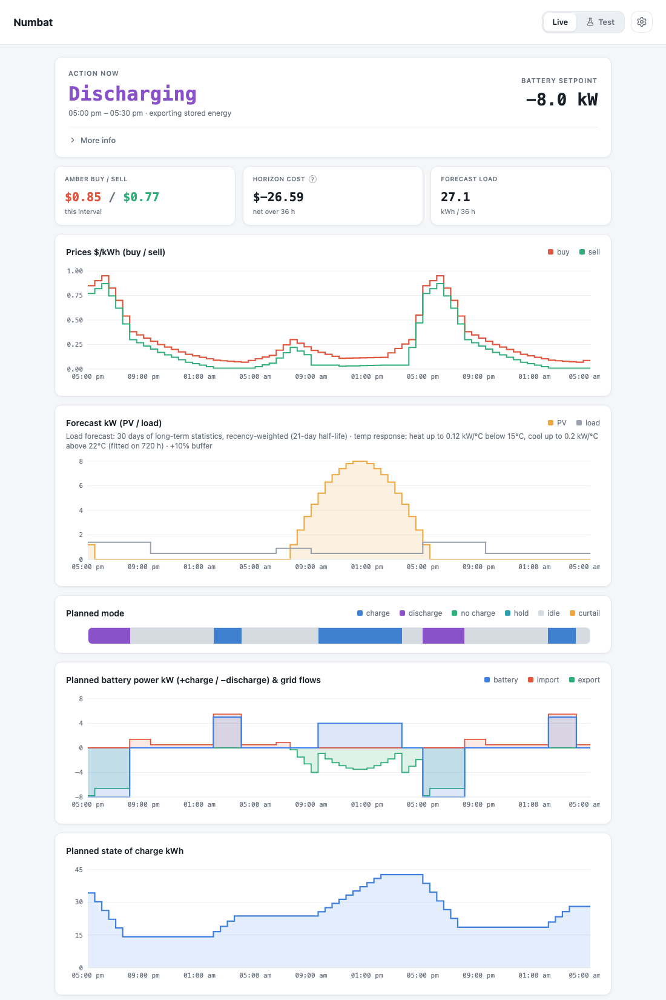

# Numbat — Energy Optimizer

**Numbat** — the **NUM**erical **BAT**tery optimizer for Home Assistant.

A Home Assistant add-on that optimizes home battery charge/discharge and
solar-export decisions against Amber Electric's 5-minute wholesale pricing.
Every 5 minutes it re-solves a mixed-integer linear program (MILP) over the
next ~36 hours and publishes what the battery should do *right now*.

Numbat is a **recommendation engine**. It never touches your inverter: it
publishes sensors, and actuation happens through a Home Assistant automation
you own (built from a shipped blueprint, with a heartbeat failsafe). That
makes it inverter-agnostic — anything HA can control can follow the plan.

**[→ Setup guide from a fresh HA install](docs/SETUP.md)** ·
**[→ Add-on docs / option reference](numbat/DOCS.md)** ·
**[→ How the optimizer thinks](numbat/OPTIMIZER.md)**

## Features

| | |
|---|---|
| **True cost optimization** | A genuine MILP over the whole horizon — spike capture, negative-price grid charging and export timing all fall out of the economics. |
| **Solar-aware** | Plans around your PV forecast, and curtails export when feed-in prices go negative. |
| **Any HA-integrated battery** | Numbat publishes recommendation sensors and ships an actuator blueprint — anything Home Assistant can control can follow the plan. |
| **User-friendly dashboard** | Live prices and the full ~36 h plan available in HA, with every setting explained in plain language. |
| **Learned load forecast** | Hour-of-day consumption learned from your home's real history, plus a fitted temperature response so heatwaves and cold snaps raise the forecast. |
| **Spike reserve** | Charge held back that only sells into confirmed spike-level prices — insurance against the spikes no forecast sees coming. |
| **Daily SoC target** | Have the battery at a chosen level by a chosen time each day. |
| **Vacation mode** | A flat standby-baseline load while the house is empty, auto-expiring the day you're back. |
| **Test mode** | Time-travel through recorded days or run synthetic scenarios against sandbox settings — see what a change would do before it goes live. |
| **Lightweight and fast** | A full re-plan is a MILP solve in tens of milliseconds; the dashboard is a small, fully offline bundle. |

Deliberately **not** included: EV charging and deferrable-load scheduling —
Numbat does one thing well: the battery.

<picture>
  <source media="(prefers-color-scheme: dark)" srcset="docs/screenshots/dashboard-dark.png">
  
</picture>

*The ingress dashboard (demo data), mid-way through selling into an evening
price peak.*

## Inputs

All via existing HA integrations — no glue automations needed:

- **Prices**: [Amber Express](https://github.com/hass-energy/amber-express) in
  advanced-price mode — Numbat parses its `forecast` attribute (Amber's own
  SmartShift prediction). The core `amberelectric` integration is not
  supported.
- **Solar forecast**: [Open-Meteo Solar Forecast](https://github.com/rany2/ha-open-meteo-solar-forecast)
  (`watts` attribute, 15-min resolution).
- **Battery**: any integration exposing SoC and battery power, e.g. Sungrow
  SHx via the [mkaiser Modbus package](https://github.com/mkaiser/Sungrow-SHx-Inverter-Modbus-Home-Assistant).
- **Load**: learned daily from your actual consumption — recency-weighted
  hour-of-day averages
  from months of long-term statistics of a house-load sensor, plus an
  optional learned temperature response (kW per degree of cooling/heating)
  applied to the forecast temps from any hourly `weather.*` entity. No load
  sensor → Numbat plans with zero load and warns on the dashboard.

## How the optimizer works

Each cycle: **gather** entity states → **normalize** onto a shared time grid →
**solve** the MILP → **publish** the plan. The grid follows the forecast's
native boundaries (5-min intervals near-term, 30-min beyond, a fractional
first step from *now*), so no forecast information is smeared by resampling.

Per step, the decision variables are battery charge/discharge power, grid
import/export, and PV curtailment, subject to:

- power balance (PV + discharge + import = load + charge + export)
- SoC dynamics with charge/discharge efficiency, SoC min/max bounds
- battery power limits, grid connection import/export limits
- no simultaneous charge & discharge (the binary variables that make it a MILP)

The objective minimizes the horizon energy bill plus a **battery wear cost**
per discharged kWh, minus a **terminal value** on energy left in the battery at
the horizon (default: median buy price × efficiency − wear, so the battery
isn't dumped at any positive price just because the horizon ends). Spike
capture, curtailment under negative feed-in, and charging on negative prices
all fall out of the economics rather than hand-written rules.

Because price forecasts are routinely wrong about spikes, several layers keep
the plan honest: an **event-triggered re-solve** reacts within seconds of any
live price change (a confirmed spike gets its full-power discharge decision
immediately — and never a grid charge), an optional **spike reserve** holds
sellable charge that releases only into a *confirmed* spike-level price
(real spikes can arrive with zero forecast warning), **hysteresis** stops
near-identical plans chattering the inverter, and solver failures or stale
inputs **fall back** to the previous plan or idle recommendations — never
silent garbage.

**[OPTIMIZER.md](numbat/OPTIMIZER.md)** explains the *why* behind all of it
in plain language — the hold value, wear cost, when it sells, every knob and
its pitfalls — and is the doc to read when a plan surprises you.

## Outputs

Published every cycle (REST sensors): `sensor.numbat_action`
(charge/discharge/idle/curtail), `sensor.numbat_power_setpoint` (signed kW, with
`power_w` attribute), `sensor.numbat_soc_target`, `sensor.numbat_horizon_cost`,
and `sensor.numbat_status` (heartbeat).
An ingress dashboard charts the plan: prices, PV/load forecasts, planned
battery power, and the SoC trajectory.

Actuation = your automation from
[blueprints/numbat_actuator.yaml](blueprints/numbat_actuator.yaml): it maps
action + setpoint onto your inverter's controls, and reverts to
self-consumption when Numbat's heartbeat goes stale. See
[numbat/DOCS.md](numbat/DOCS.md) for a complete Sungrow example.

## Under the hood

| | |
|---|---|
| Optimization | [CVXPY](https://www.cvxpy.org/) (`cvxpy-base`) + [HiGHS](https://highs.dev/) (`highspy`) — ~70 binaries/solve, tens of ms |
| Numerics | numpy (no pandas; the time-grid resampler is ~50 lines) |
| HA I/O | aiohttp — REST for states/publishing, WebSocket for event-triggered re-solves |
| Config | pydantic + pydantic-settings — edited in the web UI's Settings view, persisted to a Numbat-owned `numbat-config.json` (`NUMBAT_*` env for connection/dev) |
| Dashboard | React 19 (+ React Compiler) + Recharts + Tailwind, built with Vite/Bun into a fully offline bundle; served by FastAPI + uvicorn behind HA ingress |
| Packaging | uv-locked deps; Debian-based image (cvxpy has no musl wheels); multi-arch (amd64/aarch64) prebuilt via GitHub Actions → GHCR |

Layout: the repo root is an HA add-on repository; the add-on and all Python
lives in [numbat/](numbat/) (`src/numbat/` — adapters, timegrid, optimizer, planner,
publisher, web; the React dashboard sources in `frontend/`), with the actuator
blueprint in
[blueprints/](blueprints/).

## Install (HA OS / Supervised)

Settings → Add-ons → Add-on store → ⋮ → Repositories → add this repo's URL,
then install **Numbat — Energy Optimizer**. Prebuilt images are pulled from GHCR
(maintainer note: after the first CI publish, the `numbat-amd64`/`numbat-aarch64`
packages must be set to public on GitHub or installs can't pull them).
Full walkthrough including the input integrations: [docs/SETUP.md](docs/SETUP.md).

## Development (no Home Assistant OS required)

Run directly against any HA instance with a long-lived access token:

```sh
cd numbat
uv sync
NUMBAT_HA_URL=http://homeassistant.local:8123 \
NUMBAT_HA_TOKEN=<long-lived token> \
uv run python -m numbat
```

or via Docker, from the **repo root**: `docker compose -f docker-compose.dev.yml up --build`
(reads `NUMBAT_HA_URL`/`NUMBAT_HA_TOKEN` from your shell environment or a repo-root
`.env`; note the standalone run above uses `numbat/.env` instead).

The local timezone anchors the learned load buckets, the daily SoC target
and vacation end times. Under the Supervisor it comes from the `TZ` env var
automatically; in dev set `NUMBAT_TZ=Australia/Adelaide` (env or `numbat/.env` —
copy [numbat/.env.example](numbat/.env.example) to get started) or Numbat falls back
to UTC. The resolved zone is logged at startup.

Configure via the web UI at `http://localhost:8099` (Settings). Note the dev
server has **no authentication** — anyone on your LAN who can reach :8099 can
read and edit the config. Under the Supervisor this doesn't apply (ingress
only, HA-session-authenticated, no host port).

Tests: `cd numbat && uv run pytest`
